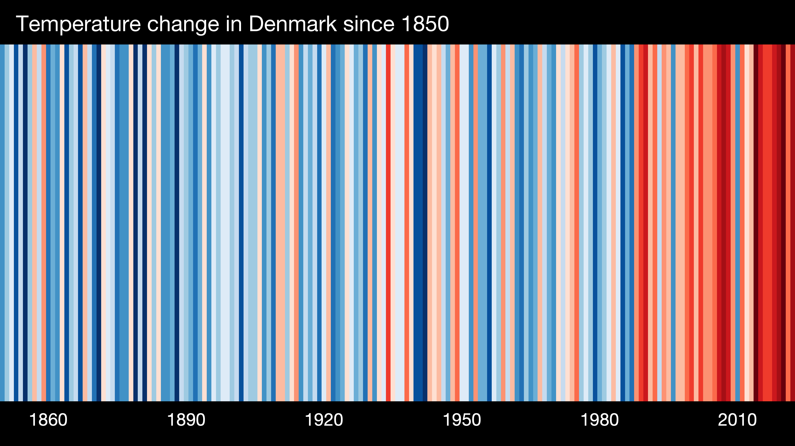

# Hackathon

Welcome to the Earth Day 2026 Hackathon! This hackathon is part of Earth Day 2026, an event that aims to bring together researchers and all interested to discuss the latest research on climate change, its impacts, and ways to communicate them to the general public. The hackathon is an opportunity for participants to work together to develop innovative ways of disseminating the causes and effects of climate change.

## Instructions

### The challenge

Your aim is to develop a tool that can be used to communicate the causes and effects of climate change to the general public. The tool can be a plot, gif, website, an app, a game, a visualization, or any other form of communication that you think will be effective in reaching a wide audience. The tool should be engaging, informative, and easy to understand, and should be based on true scientific data.

### The data

You can use any data you like to develop your tool, the only restriction is that it has to be *true data publicly available*. 

Examples of data sources include:

- [Our World in Data](https://ourworldindata.org/climate-change)
- [IPCC Data Distribution Centre](https://www.ipcc-data.org/)
- [NOAA Climate Data Online](https://www.ncei.noaa.gov/cdo-web/)
- [NASA GISS Surface Temperature Analysis](https://data.giss.nasa.gov/gistemp/)
- [Zachary Labe Repository](https://zacklabe.com/resources-and-data-references/)

### The task

1. Form a team of 2-4 people. You can also participate individually.
2. Choose the data you want to use. You can combine data from different sources if you like.
3. Develop a tool to communicate the causes and/or effects of climate change. You are free to use any programming language or software you like.
4. Prepare a short pitch/presentation to showcase your tool to the judges.
5. Submit the steps to reproduce your tool in a GitHub repository or via email to the organizers.

### The timeline

- 11:45-12:00 Hackathon instructions and Q&A.
- 12:00-16:30 Hackathon with pizza drop around 13:00.
- 16:30 Deadline for submission of solutions. 
- 16:30-17:00 Evaluation of solutions.
- 17:00 Hackathon winner announcement.

### Examples

As inspiration, you can look at [*show your stripes*](https://showyourstripes.info/):

Or the following gif:

### The judging

The judging will be based on the following criteria:

- **Innovation**: How innovative is the tool?
- **Engagement**: How engaging is the tool?
- **Informative**: How informative is the tool?
- **Ease of understanding**: How easy is it to understand the tool?
- **Relevance**: How relevant is the tool to the challenge?

---

